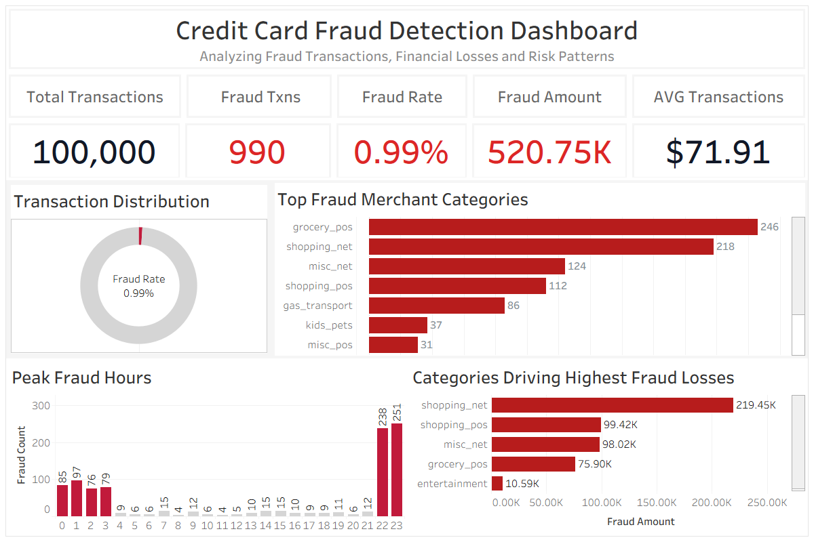
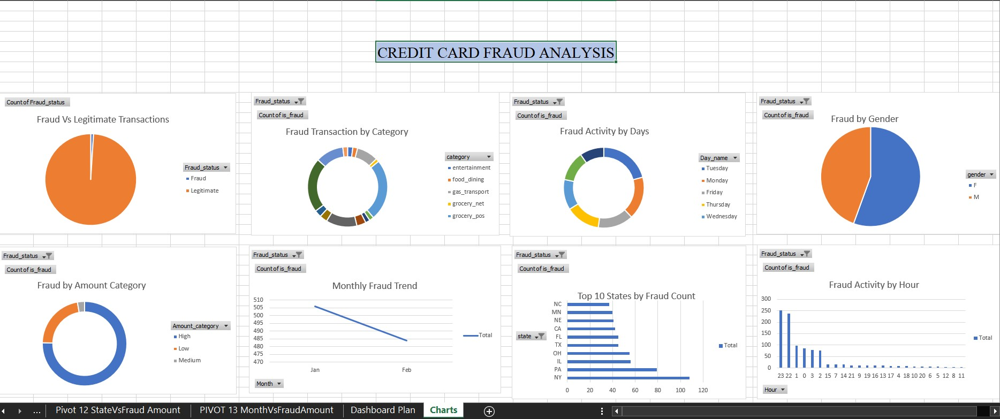

# Credit Card Fraud Detection Analysis
#Created by **Omkar Malgi**

A business-focused data analysis project that investigates credit card transactions to identify fraudulent activity, measure key fraud metrics, and present actionable insights using **MySQL, Microsoft Excel, and Tableau**.

---

## Dashboard Preview

### Tableau Dashboard



### Excel Dashboard



---

## Project Summary

This project analyzes anonymized credit card transaction data to understand fraud patterns and transaction behavior. Using SQL for data analysis and Excel/Tableau for visualization, the project demonstrates how business analysts transform raw transactional data into meaningful insights that support fraud monitoring and decision-making.

**Tools Used**

- MySQL
- Microsoft Excel
- Tableau

---

## Business Objectives

The analysis aims to answer key business questions, including:

- What percentage of transactions are fraudulent?
- How many genuine and fraudulent transactions are present?
- What are the average, minimum, and maximum transaction amounts?
- How are transaction amounts distributed?
- What percentage of total transaction value comes from fraudulent transactions?
- Which transaction ranges contain the highest fraud occurrence?
- How can fraud-related KPIs be visualized for business stakeholders?

---

## Dataset Information

The dataset consists of anonymized credit card transactions where sensitive customer information has been transformed for privacy.

| Column | Description |
|---------|-------------|
| Time | Seconds elapsed since the first transaction |
| V1 – V28 | Anonymized transaction features |
| Amount | Transaction amount |
| Class | Transaction Label (0 = Genuine, 1 = Fraud) |

---

## Repository Structure

```
credit-card-fraud-detection-analysis/
│
├── Dataset/
│   ├── creditcard_raw.csv
│   └── CREDIT_CARD_FRAUD_ANALYSIS.xlsx
│
├── SQL/
│   ├── Credit Card Fraud Analysis.sql
│
├── Tableau/
│   ├── Credit Card Fraud Detection Dashboard.twb
│
├── Dashboards/
│   ├── excel_dashboard.jpg
│   └── TableAu - Credit Card Fraud.png
│
└── README.md
```

---

## SQL Analysis

The project includes a comprehensive SQL analysis covering multiple business scenarios such as:

- Total transaction analysis
- Fraud vs genuine transaction comparison
- Fraud percentage calculation
- Transaction amount statistics
- Average transaction value
- Maximum and minimum transaction amount
- Fraud transaction value analysis
- Transaction amount segmentation
- KPI calculations
- Business summary metrics

All SQL queries are available in:

```
SQL/Credit Card Fraud Analysis.sql
```

---

## Excel Dashboard

The Excel dashboard provides a high-level business view of fraud activity using KPI cards and interactive charts.

**Key Highlights**

- Total Transactions
- Fraud vs Genuine Distribution
- Fraud Percentage
- Transaction Amount Analysis
- Business KPIs

---

## Tableau Dashboard

The Tableau dashboard enables interactive exploration of fraud metrics and transaction behavior through dynamic visualizations.

**Key Highlights**

- KPI Overview
- Fraud Distribution
- Transaction Amount Analysis
- Interactive Filters
- Executive Dashboard

---

## Key Business Insights

- Genuine transactions account for the vast majority of total transactions, while fraudulent transactions represent only a small fraction of overall activity.
- Although fraud occurrence is relatively low, fraudulent transactions contribute to significant financial risk, making continuous monitoring essential.
- Transaction amount analysis helps identify spending patterns associated with fraudulent behavior.
- Combining SQL analysis with interactive dashboards enables faster identification of anomalies and supports informed business decisions.
- Dashboard-driven reporting provides stakeholders with a clear and accessible view of fraud-related performance metrics.

---

## Skills Demonstrated

- Data Cleaning
- SQL Data Analysis
- Business Analytics
- KPI Development
- Fraud Analysis
- Data Visualization
- Dashboard Design
- Microsoft Excel
- Tableau
- Business Insight Generation

---

## Author

**Omkar Malgi**

Business Analyst | SQL | Excel | Tableau

If you found this project useful or have any suggestions, feel free to connect and share your feedback.
